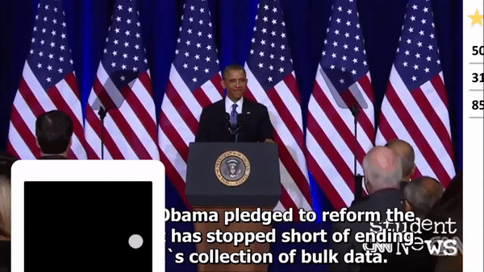

# Interactive Social TV Service
*A redesigned Smart TV: Enjoy **Motion Control**, **Social Media** and **Cable Channels** with your smartphone*

## What's new?
Interactive Social TV (ISTV) provides a modern viewing experience when watching traditional cable TV channels along with staying connect with social media.

Users can view their channel bookmarks, watch history and social media notifications on screen while watching TV. You can navigate through your beloved channels and never miss a notification from Facebook. The service also provides **channel recommendation notification** that recommends channel that you might have been interested in.

All of the control can be done by your smartphone. You can **voice commands** and  **simple gestures** to switch channels and APPs. You can view detailed channel information on your phone. 

Have you been frustrated when switching channels between ads?  With ISTV, you can easily tell when the ads has finished and switch back to your desired channel. 

## System Structure

The core system includes: TV Controller Android App (client) and the Smart TV App(server).

The client and the server communicates through [Alljoyn](https://openconnectivity.org/developer/reference-implementation/alljoyn) , a common protocol for IoT devices. All the control commands and image uploades are sent through the Allsean Alljoyn Channel.

## Features
### Launcher

Redesigned clean and simple launcher offers a better user experience than the original MStart TV. You can switch between APPS through hand gestures.

### Smart TV Viewer

#### History and Bookmarks

Easy to access your favorate channels and past history.

#### Notification and Recommendation

While watching TV, all your social media notifications will show on screen so that you don;t have to check your phone once a minute. Moreover, you can share your thoughts about the channel you are current watching to your social media with just a click.

Through recording users' watching history, our model will recommend the channels that you are most likely to be interested in.

### Instant Share

You can share your photos with your friends and family with ISTV easily.

## Awards
**National Champion** at Ministry of Economic Affairs ‘Get Fresh’ System Development Competition 2015 ([link](http://www.getfresh.org.tw/achievement_detail.aspx?No=249))

Advisor: Prof. Ling-Chieh Kun

## Notes
Demo Video: https://www.youtube.com/watch?v=1Ml-EV4KOPw
This repository only contains the code for the ISTV Android Controller App. The server and launcher are on Bitbucket.  

